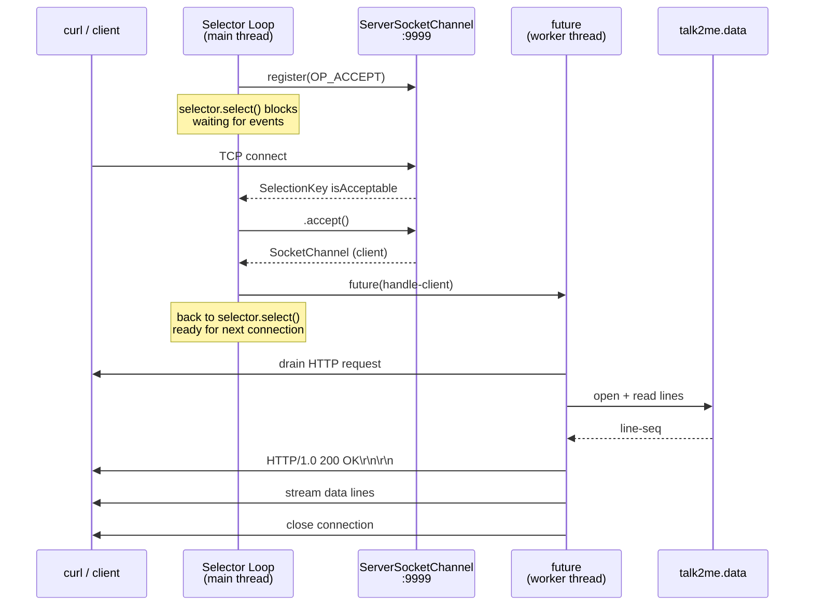

talk2me.clj
--------------

clojure version of https://github.com/prayagupa/talk2me

## How it works


```mermaid
sequenceDiagram
    participant C as curl / client
    participant SL as Selector Loop<br/>(main thread)
    participant SC as ServerSocketChannel<br/>:9999
    participant F as future<br/>(worker thread)
    participant D as talk2me.data

    SL->>SC: register(OP_ACCEPT)
    note over SL: selector.select() blocks<br/>waiting for events

    C->>SC: TCP connect
    SC-->>SL: SelectionKey isAcceptable
    SL->>SC: .accept()
    SC-->>SL: SocketChannel (client)
    SL->>F: future(handle-client)

    note over SL: back to selector.select()<br/>ready for next connection

    F->>C: drain HTTP request
    F->>D: open + read lines
    D-->>F: line-seq
    F->>C: HTTP/1.0 200 OK\r\n\r\n
    F->>C: stream data lines
    F->>C: close connection
```

## run server

```
lein run
```

## test

```bash
curl -XGET localhost:9999
```
